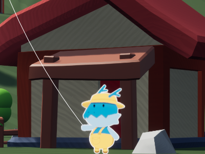
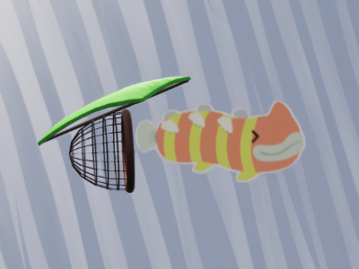
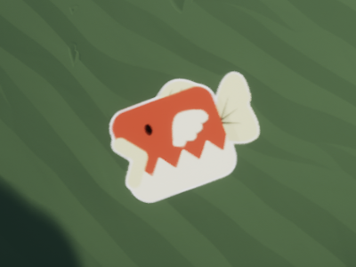
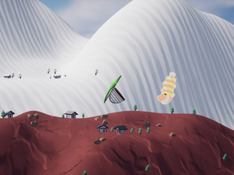
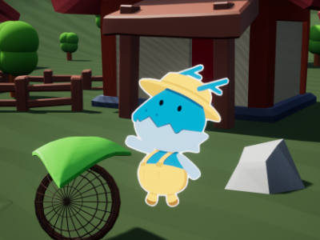

import TwoColumn from "../../components/content-components/TwoColumn.astro";

<TwoColumn>
    

        #### Preface
        I decided to join a 2-day game jam. The theme was **Fishing & No Water**. I met new people and formed a team of 12 people all around the world! We worked together on a Discord call to make it all happen.
    

    

        
    

</TwoColumn>

<TwoColumn>
    

        #### Creating The Kite
        We designed a game where you fish birds out of the sky using a kite. You control the kite to chase birds and catch them. I wrote logic that takes player input and flies the kite. I also wrote logic that detects the fish-birds, when the kite hovers over a fish-bird for a second, the fish-bird gets caught.
    

    

        
    

</TwoColumn>

<TwoColumn>
    

        #### Pathfinding & Avoidance

    

    

        
    

</TwoColumn>

<TwoColumn>
    

        #### Adapting Audio

    

    

        
    

</TwoColumn>

<TwoColumn>
    

        #### Reeling Back

    

    

        
    

</TwoColumn>