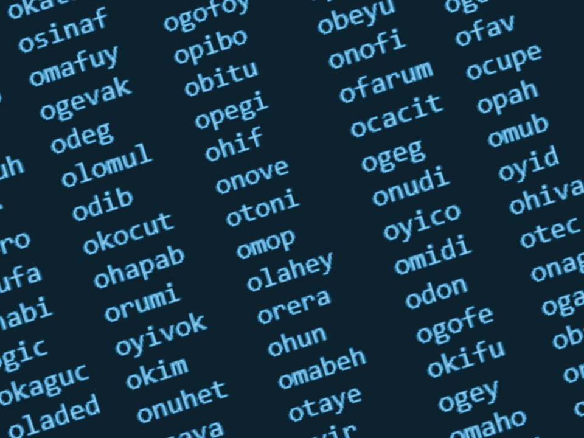

Finding a marketable name is very hard. So I wrote this python script to help me find a brand name.

On April 2 2020, I started a YouTube channel to post game development videos. Around 500 subscribers, I wanted to rename my channel to fit my vision better. I brainstormed but got exhausted. So I decided to write a program that would do the heavy work for me.

## How It Works
`12312`

## So, Does It Generate Marketable Names?
Maybe :D It's too random and often generates words that are hard to pronounce and don't sound great. But if you run it enough you'll come across something nice eventually, obviously that's not good.

## What's Next?
I am working on an improved version of Word Maker. I am taking the core idea of generating words from user defined procedures, and improving it by writing cleaner code and making it easier to use.

I am using Rust because I'm itching to create a project with it. I am also thinking about having a CLI to execute the program.

I see this project as a proof of concept. For the new version, I am focusing on having generated words that sound nice to the ear.